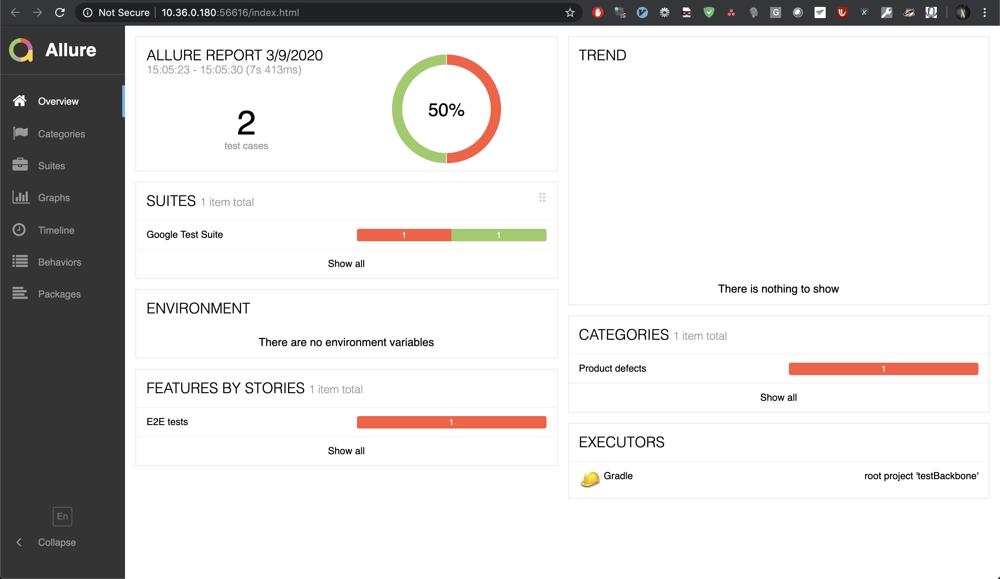
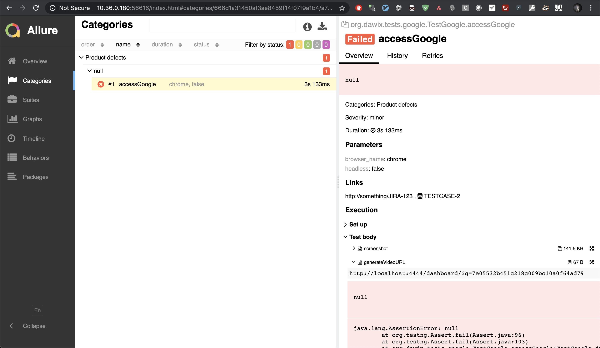
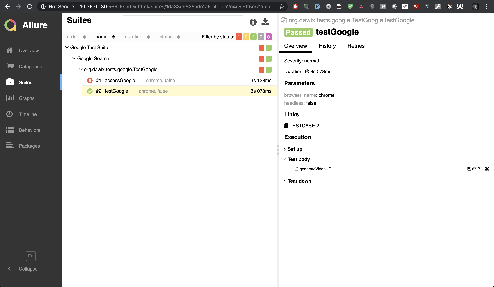
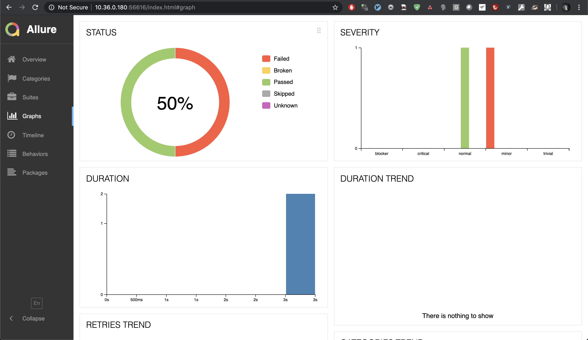
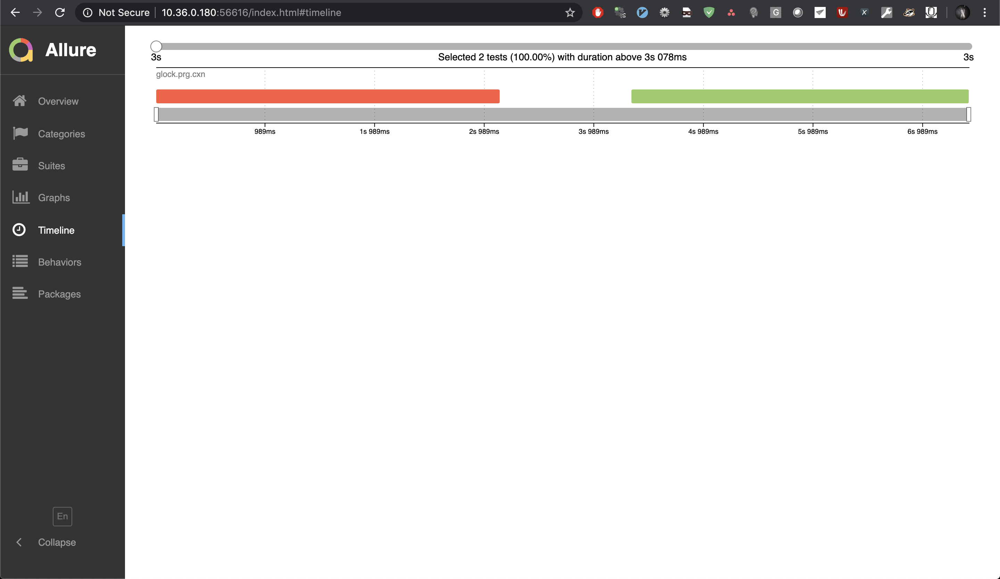
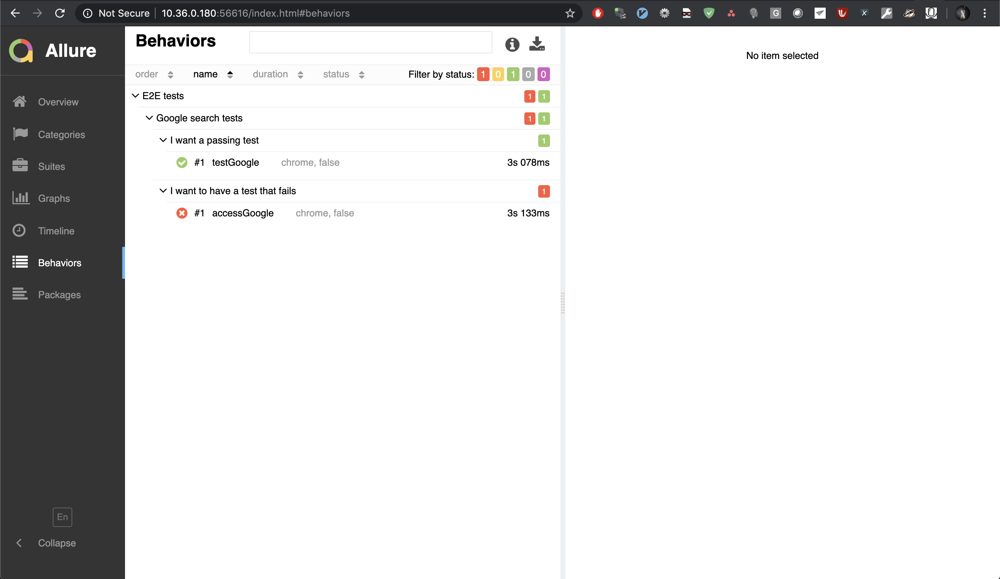

#Contributing
Pushing into master is not permitted. Changes are possible only through pull requests.

To make things easier, you can install `python3 -m pip install git-pull-request`
When branch is created (for example with `git checkout -b myownbranch --track origin/master`)
just `git pull-request` to create/update pull request.

# Test suite backbone
Using Zalenium, TestNG and Allure. !!!Proof of Concept!!!

## Zalenium
RemoteWebdriver is currently hardcoded for a local instance of Zalenium
To run Zalenium, you will need Docker and `docker-compose`

* Find `<ProjectRoot>/docker/docker-compose-yml`
* Go to the directory and run `docker-compose up`

After that Zalenium should be ready

* Your dashboard should be available after first test run on `http://localhost:4444/dashboard`
* You can see live previw of executed tests at `http://localhost:4444/grid/admin/live`
Check the `org.dawix.listeners.AllureListener` class for how allure reporting is done

## TestNG

Tests are available in `org.dawix.tests` 

* `./gradlew cleanUp playground` to execute sample tests
* `./gradlew allureServe` to generate Allure report and automatically serve it in browser

If you do not want to serve in browser automatically, `./gradlew allureReport` will generate the reports for usage by
Jenkins for example.

## Allure

There is `allure-testng` used in the Java Code and reporting is handled by `allure-gradle` plugin.

The actual settings that matters can be seen in TestNG listener in `org.dawix.listeners.AllureListener`

* Output:

* Categories (using default currently - TODO)

* Tests classified by Suites

* Some graphing

* Timeline statistics

* And behaviour classification of the tests
